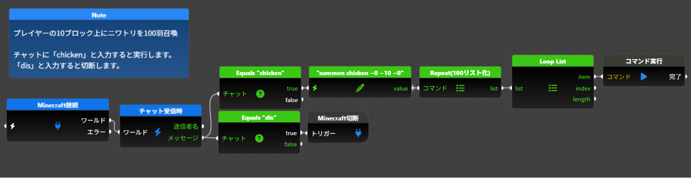

[🇺🇸 English](README.md) | 🇯🇵 日本語

# flyde-minecraft-bedrock

Minecraft Education Edition / Bedrock Edition を、ビジュアルフロープログラミング（[Flyde](https://github.com/flydelabs/flyde)）で操作するためのノード集です。

ノードをワイヤーで繋ぐだけで、プレイヤーの行動やブロック・アイテムのイベントをきっかけに Minecraft 内でコマンドを実行したり、座標・状態を取得したりするフローを作れます。プログラミング教育の教室での利用を想定しています。

## 無料版と有料版

このリポジトリは **無料版（個人利用向け）** のビルド済みノードと使い方を公開しています。ソースコード自体は非公開です。

| | 無料版 | フル版（有料） |
|---|---|---|
| 内容 | 個人向けノードのみ（接続・イベント・基本コマンド・座標演算など） | 全ノード（エージェント操作・スコアボードなどを含む） |
| ライセンス | [Prosperity Public License 3.0.0](LICENSE.md)（非商用利用は無償、商用利用は30日間の無料トライアル） | 商用ライセンス（1ライセンス1名様、再配布不可） |
| 配布形式 | zip（ベータ公開中） | zip（購入者向け） |

## 購入

~~[Gumroad（フル版）](#)（準備中）~~
~~[BOOTH（フル版）](#)（準備中）~~

現在公開しているのは無料版のベータ版（v1.0.0-beta.1）のみです。有料版（フル版）はまだ公開しておらず、動作確認・テストが完了し次第、販売を開始する予定です。

## インストール

zip配布のみとなっています（npmでは公開していません。理由は [USAGE.ja.md](USAGE.ja.md) を参照）。

[Releases](#)（準備中）から最新の zip をダウンロードしてください。セットアップ手順は [USAGE.ja.md](USAGE.ja.md) を参照してください。

## 含まれるノード（無料版）

- **接続**：Minecraft サーバーへの接続・切断
- **プレイヤーイベント**：チャット・移動・テレポート
- **ブロックイベント**：設置・破壊
- **アイテムイベント**：使用・入手
- **ゲームプレイコマンド**：コマンド実行・時刻・天気・エリア塗りつぶし
- **プレイヤーコマンド**：座標・向き・ゲームモード取得
- **情報取得**：エンティティ・プレイヤー・アイテム・ブロックのスナップショットから値を取り出す
- **変換・選択**：セレクター文字列の組み立て、ロケール名変換
- **座標演算**：ベクトル演算・文字列化・分解

詳しい使い方は [USAGE.ja.md](USAGE.ja.md) を参照してください。

## フル版限定カテゴリ（有料）

- **エージェント操作**：プログラム可能なエージェントの移動・採掘・設置・アイテム操作
- **スコアボード**：得点・変数管理
- **タグ管理**：プレイヤーのタグ取得・判定
- **モブイベント**：モブとのインタラクト・狙ったブロックへの命中判定
- **追加プレイヤーイベント**：バウンド・変身（座標・向きの変化を毎tick検知）
- **追加アイテムイベント**：クラフト・装備・精錬・取引
- **追加プレイヤー機能**：参加・退出イベント、タイトル表示・メッセージ通知、経験値レベル・装備状態、オンラインプレイヤー一覧
- **追加情報取得**：スコアボード目標・モブ・村人のスナップショット・ワールド情報から値を取り出す
- **追加座標演算**：距離計算・クランプ・AABB・補間・正規化・内積

## 動作環境

- Minecraft Education Edition または Bedrock Edition（WebSocket 接続が有効なもの）
- [Flyde](https://github.com/flydelabs/flyde) (VSCode拡張)

## ライセンス

[Prosperity Public License 3.0.0](LICENSE.md) — 非商用目的（個人・学校・公的機関等）であれば無期限に無料です。商用利用は30日間の無料トライアルが可能で、それ以降は有料のPatron Licenseが必要です。改造・再配布・販売は禁止されています。
