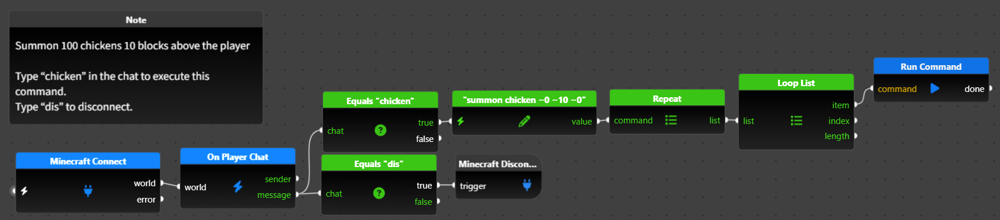

🇺🇸 English | [🇯🇵 日本語](README.ja.md)

# flyde-minecraft-bedrock

A collection of nodes for controlling Minecraft Education Edition / Bedrock Edition through visual flow-based programming ([Flyde](https://github.com/flydelabs/flyde)).

Just by wiring nodes together, you can build flows that run Minecraft commands or read coordinates/state, triggered by player actions, block events, or item events. Designed for use in programming education classrooms.

## Free Edition vs Full Edition

This repository publishes the built nodes and usage guide for the **Free Edition (personal use)**. The source code itself is not public.

| | Free Edition | Full Edition (paid) |
|---|---|---|
| Contents | Personal-use nodes only (connection, events, basic commands, vector math, etc.) | All nodes (including agent control, scoreboard, etc.) |
| License | [PolyForm Noncommercial 1.0.0](LICENSE.md) (non-commercial use only) | Commercial license (1 license per person, no redistribution) |
| Distribution | zip (beta) | zip (for purchasers) |

## Purchase

~~[Gumroad (Full Edition)](#) (coming soon)~~
~~[BOOTH (Full Edition)](#) (coming soon)~~

Currently only the Free Edition beta (v1.0.0-beta.1) is published. The paid Full Edition has not been released yet and will go on sale once testing and verification are complete.

## Installation

This is distributed as a zip file (not via npm — see [USAGE.md](USAGE.md) for why).

Download the latest zip from [Releases](#) (coming soon). See [USAGE.md](USAGE.md) for setup steps.

## Included nodes (Free Edition)

- **Connection**: Connect/disconnect to a Minecraft server
- **Player events**: Chat, movement, teleport
- **Block events**: Place, break
- **Item events**: Use, acquire
- **Gameplay commands**: Run command, time, weather, fill area
- **Player commands**: Get position, orientation, game mode
- **Info extraction**: Pull values from entity / player / item / block snapshots
- **Selectors / converters**: Build selector strings, convert locale names
- **Vector math**: Vector operations, stringify, split

See [USAGE.md](USAGE.md) for detailed usage instructions.

## Full Edition exclusive categories (paid)

- **Agent control**: Move, mine, place, and handle items with a programmable agent
- **Scoreboard**: Score/variable management
- **Tag management**: Get/check player tags
- **Mob events**: Mob interaction, target block hit detection
- **Additional player events**: Bounce, transform (per-tick position/rotation change detection)
- **Additional item events**: Craft, equip, smelt, trade
- **Additional player features**: Join/leave events, title display, message notifications, XP level/equipment status, online player list
- **Additional info extraction**: Pull values from scoreboard objectives, mob/villager snapshots, and world info
- **Additional vector math**: Distance, clamp, AABB, lerp, normalize, dot product

## Requirements

- Minecraft Education Edition or Bedrock Edition (with WebSocket connections enabled)
- [Flyde](https://github.com/flydelabs/flyde) (VSCode extension)

## License

[PolyForm Noncommercial License 1.0.0](LICENSE.md) — Free for non-commercial use only. Modification, redistribution, and resale are prohibited.
